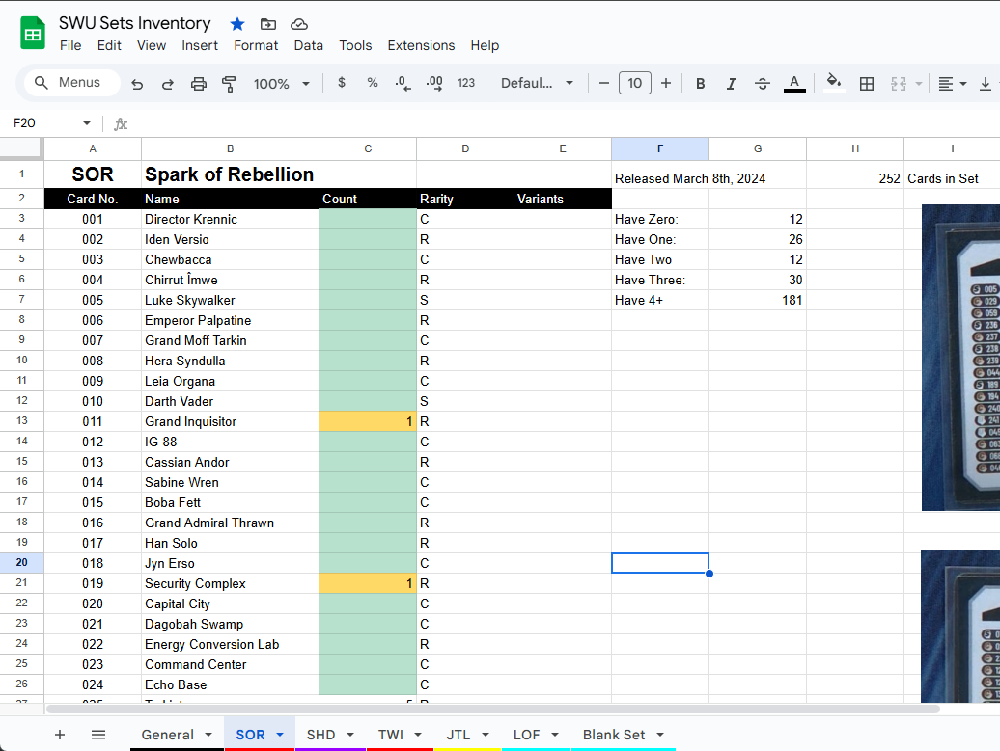

# Star Wars Unlimited(SWU) Tools
Scripts to manage descriptions and meta data for my card list inventory in google sheets

## Local Setup
- Install Python, UV
- Run `uv sync` to install python libraries needed.

## Set Up in Google Docs:
- Go into googles api, you need to enable google drive, docs, and sheets api
- Create an api service account, done in the api.
- Share the google sheet you want modified with the service account, give them full editor rights
- Add credentials for the service account and api urls in your credentials.json file 
 
Note: If you are not sure how to do this. ChatGPT generated a step by step how-to for this, the prompt I used was "How do I edit a google doc sheet with python?"

## Files
- `main.py` will download card lists as json from a swudb api into a pandas dataframe. It then will pull cards names and rarity into the columns I specify.
- `./lib/swudb.py` library functions to pull card lists based on set abbreviation name "SOR, SHD, TWI, JTL, etc"
- `lookup_card.py` Start of a card lookup script, should pull all info of a card based on set and card number and print it to console.
- `sort_deck_by_set.py` Takes a deck list and outputs cards sorted by set. Useful for gathering cards from binders organized by set.

## Deck Sorting Tool
The `sort_deck_by_set.py` script helps gather cards for a deck from set-organized binders.

**Usage:**
```bash
uv run python sort_deck_by_set.py "path/to/decklist.txt"
```

**Features:**
- Supports Picklist (.txt) and JSON (.json) deck formats from swudb.com
- Groups cards by set (SOR, SHD, TWI, JTL, LOF, SEC), sorted by card number
- Prefers main sets over promo printings for cards in multiple sets
- Shows alternate sets for reprints (e.g., "also in: P25, LOFP")
- Outputs to console and saves a `-sorted.md` file in the same folder

**Input formats:**
- Picklist format: Export from swudb.com deck builder (has card names + all set printings)
- JSON format: Export from swudb.com (has set/number, card names fetched via API)

## Google Sheet Inventory
How I set up my inventory. I set up my functions in `main.py` with this format in mind.
- I have one google sheet with my inventory, and separate sheet tabs for each set each named by set abbreviation.
- In cell H1 of every tab I have the card count for that set(listed here: 'https://swudb.com/sets').
- The card names are Column B starting at cell B3
- Card rarities are column D starting at D3


## Notes:
- The google api only supports so many actions per minute, so if you want to add and retrieve data from your sheet keep that in mind. This is why I gather a list data struct and push the whole list to the sheet at once when updating the rename column.
- When I run this to update card names I will do one set list at a time to make sure I do not hit the google actions limit.