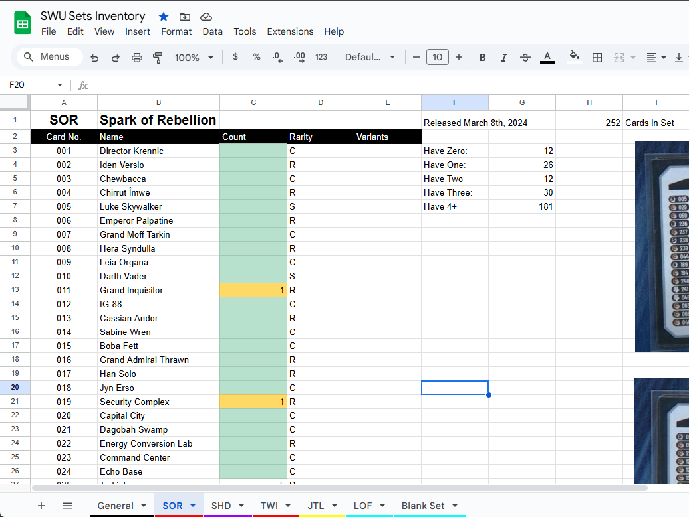

# Star Wars Unlimited(SWU) Tools
Scripts to manage descriptions and meta data for my card list inventory in google sheets

## Local Setup
- Install Python, UV
- Run `uv sync` to install python libraries needed.

## Set Up in Google Docs:
- Go into googles api, you need to enable google drive, docs, and sheets api
- Create an api service account, done in the api.
- Share the google sheet you want modified with the service account, give them full editor rights
- Add credentials for the service account and api urls in your credentials.json file 
 
Note: If you are not sure how to do this. ChatGPT generated a step by step how-to for this, the prompt I used was "How do I edit a google doc sheet with python?"

## Files
- `main.py` will download card lists as json from a swudb api into a pandas dataframe. It then will pull cards names and rarity into the columns I specify.
- `./lib/swudb.py` library functions to pull card lists based on set abbreviation name `SOR, SHD, TWI, JTL, LOF, SEC, LAW`, plus `TS26` for Twin Suns 2026 deck cards
- `./card_data/` cached JSON files for each set (loaded before hitting the API)
- `lookup_card.py` Start of a card lookup script, should pull all info of a card based on set and card number and print it to console.
- `sort_deck_by_set.py` Takes a deck list and outputs cards sorted by set. Useful for gathering cards from binders organized by set.
- `update_used_card_list.py` Tracks all cards in use across multiple SWUDB decks. Maintains a SQLite database and exports a markdown summary.
- `validate_deck_format.py` Fetches a SWUDB deck, detects whether it is Premier-style or Twin Suns, and reports legality for Premier, Eternal, and Twin Suns.
- `trilogy_validator.py` Validates three SWU decks together as a Premier Trilogy or Twin Suns Trilogy Gauntlet build (distinct leaders/bases + combined-copy limit).
- `deck_diff.py` Shows a GitHub-style diff of two decks (added / removed cards) for deckbuilding iteration.
- `./lib/deck_source.py` Unified loader that returns a normalized deck from a SWUDB URL, `.json`, `.txt` picklist, or sorted `.md` file.

**Note on private decks:** The SWUDB deck API only serves **Public** or **Unlisted** decks. A Private deck still renders in the browser but returns 404 from the API. Every deck-fetching script (`sort_deck_by_set.py`, `update_used_card_list.py`, `validate_deck_format.py`, `trilogy_validator.py`, `deck_diff.py`) prints a hint suggesting you change visibility to Unlisted when it sees a 404.

## Deck Sorting Tool
The `sort_deck_by_set.py` script helps gather cards for a deck from set-organized binders.

**Usage:**
```bash
uv run python sort_deck_by_set.py "path/to/decklist.txt"
```

**Features:**
- Supports Picklist (.txt) and JSON (.json) deck formats from swudb.com
- Groups cards by set (SOR, SHD, TWI, JTL, LOF, SEC, LAW, then TS26), sorted by card number
- Prefers main sets over promo printings for cards in multiple sets
- Shows alternate sets for reprints (e.g., "also in: P25, LOFP")
- Outputs to console and saves a `-sorted.md` file in the same folder

**Input formats:**
- Picklist format: Export from swudb.com deck builder (has card names + all set printings)
- JSON format: Export from swudb.com (has set/number, card names fetched via API)

## Used Card List Tracker

The `update_used_card_list.py` script tracks all cards in use across multiple SWUDB decks.

**Usage:**
```bash
# Add a deck to tracking
uv run python update_used_card_list.py add "https://swudb.com/deck/KRvnhNGlV"

# Remove a deck from tracking
uv run python update_used_card_list.py remove "https://swudb.com/deck/KRvnhNGlV"

# List all tracked decks
uv run python update_used_card_list.py list

# Regenerate markdown output
uv run python update_used_card_list.py export

# Remove all decks and archive the markdown file
uv run python update_used_card_list.py remove-all
```

**Features:**
- Tracks cards across multiple decks with quantity per deck
- Supports both Premier and Twin Suns deck formats (auto-detected from API)
- Includes main deck and sideboard cards
- Groups cards by set, sorted by card number
- Shows total quantity and per-deck breakdown

**Output files:**
- `card_data/cards_in_use.db` - SQLite database storing decks and cards
- `swudb_lists/cards_in_use.md` - Markdown summary (auto-generated on add/remove)

**Output format:**
```
## Tracked Decks (2)
- [1] [Deck Name](url) (Premier)
- [2] [Other Deck](url) (Twin Suns)

## Cards (N unique)
Format: `- NUMBER: Card Name (xTOTAL) [DECK:QTY, ...]`

### SOR (X cards)
- 134: Ruthless Raider (x4) [1:1, 2:3]
```

The `[1:1, 2:3]` means: 1 copy in deck 1, 3 copies in deck 2 (4 total).

## Deck Format Validator

The `validate_deck_format.py` script checks a SWUDB deck URL against the current sourced rules for Premier, Eternal, and Twin Suns.

**Usage:**
```bash
uv run python validate_deck_format.py "https://swudb.com/deck/KRvnhNGlV"
```

**Features:**
- Detects whether the submitted deck is `Premier-style constructed` or `Twin Suns`
- Reports `VALID` or `INVALID` for Premier, Eternal, and Twin Suns
- Explains why a deck fails a format check
- Applies Premier rotation for `SOR`, `SHD`, and `TWI` starting with `LAW`
- Treats `TS26` as legal in Eternal and Twin Suns, but not Premier

**Current limitations:**
- Reprint legality is currently resolved by full printed card name from the sourced card data
- Premier suspension checks are the only suspension checks currently applied

## Trilogy Validator

The `trilogy_validator.py` script validates three SWU decks together as a Trilogy build. It auto-detects whether the three decks are Premier-style (3-copy combined limit) or Twin Suns (1-copy combined limit, the unofficial *Twin Suns Trilogy Gauntlet* community format).

**Usage:**
```bash
uv run python trilogy_validator.py <deck1> <deck2> <deck3>
```

Each `<deck>` may be a SWUDB URL, a `.json` deck export, a `.txt` picklist, or a sorted `.md` file produced by `sort_deck_by_set.py`.

**Checks per deck:** runs the existing Premier or Twin Suns validation. When the source isn't a URL, aspect / `alternativeDeckMaximum` / suspended-name checks are skipped (with a printed note).

**Cross-deck checks:**
- All leaders distinct across the three decks (no leader may repeat in any slot).
- All three bases distinct.
- Combined-copy limit: 3 for Premier Trilogy, 1 for Twin Suns Trilogy Gauntlet.

**Search a deck list (`--lists FILE`):**
```bash
uv run python trilogy_validator.py --lists swudb_lists/twin_suns_lists.md
```
Pass a markdown file with `- [Name](URL)` lines (one deck per bullet) and the validator searches every combination of 3 for a valid Trilogy. If none qualify, it reports the closest combination — the one with no duplicate leaders/bases and the fewest cards over the combined-copy limit — and prints the specific shared cards.

## Deck Diff

The `deck_diff.py` script prints a GitHub-style diff between two decks — useful when iterating on a list and you want to know exactly which cards to pull and which to add.

**Usage:**
```bash
uv run python deck_diff.py <old_deck> <new_deck>
```

Each argument may be a SWUDB URL, `.json`, `.txt`, or sorted `.md` file. Cards are matched by `(set, number)`, so a reprint swap (same name, different set) reads as one removal + one addition. Sections covered: leaders, base, main deck, sideboard. Sideboard is folded into the main deck for the diff when either source is a non-URL file (because picklist/markdown formats don't carry sideboard separately).

## Google Sheet Inventory
How I set up my inventory. I set up my functions in `main.py` with this format in mind.
- I have one google sheet with my inventory, and separate sheet tabs for each set each named by set abbreviation.
- In cell H1 of every tab I have the card count for that set(listed here: 'https://swudb.com/sets').
- The card names are Column B starting at cell B3
- Card rarities are column D starting at D3


## Notes:
- The google api only supports so many actions per minute, so if you want to add and retrieve data from your sheet keep that in mind. This is why I gather a list data struct and push the whole list to the sheet at once when updating the rename column.
- When I run this to update card names I will do one set list at a time to make sure I do not hit the google actions limit.

## Set Notes
- Main release-set order in the tools is `SOR`, `SHD`, `TWI`, `JTL`, `LOF`, `SEC`, `LAW`.
- The upcoming Twin Suns 2026 deck cards use official set code `TS26`.
- `TS26` is treated as a supported supplemental set code in deck sorting and cards-in-use tooling, and sorts after the main release sets.
